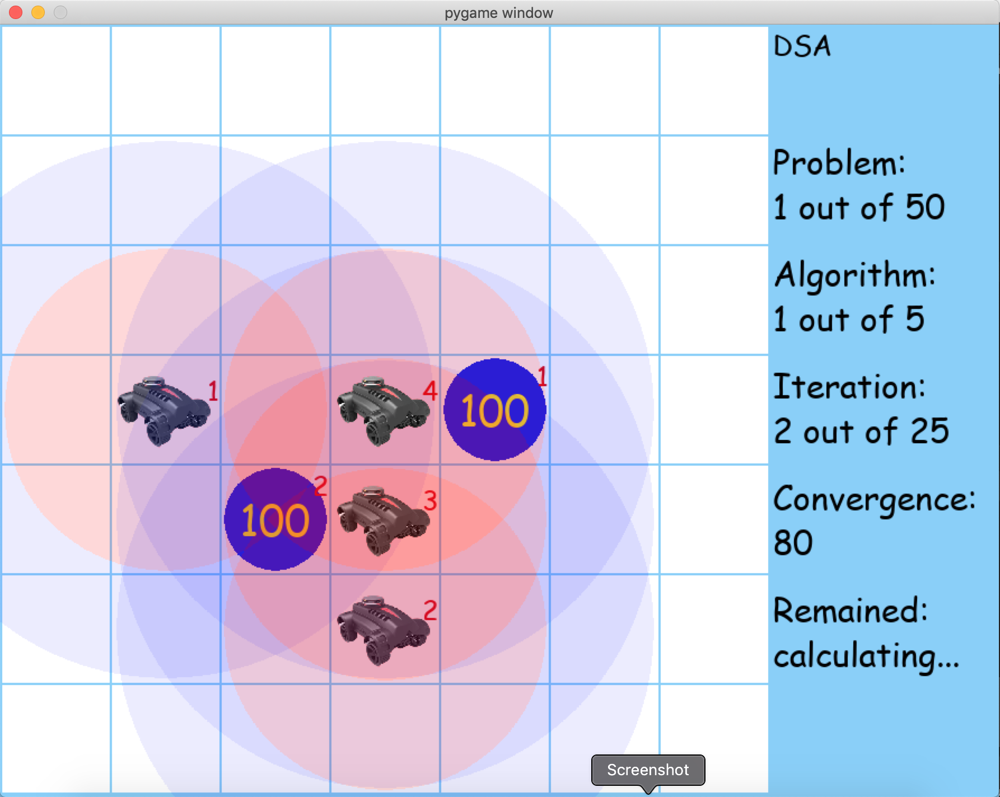

# simulator_dcop_mst

Distributed Constrained Optimization Problems 
in context of Mobile Sensor Teams (DCOP_MST).
This simulator helps to improve the understanding
of underlying dynamics of those kind of problems.

The initial settings are in Main.py file.

The screen sample:

